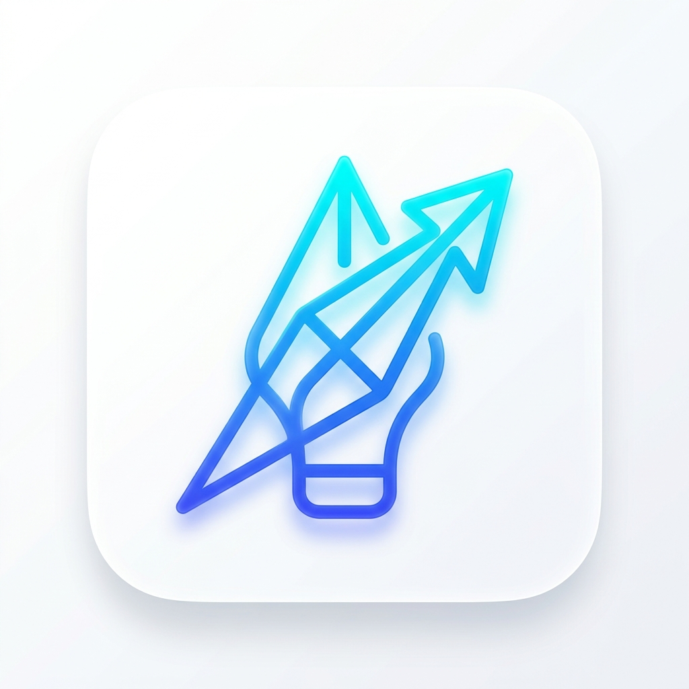

<div align="center">



# SEEKR

### The AI-Native Discovery & Drafting Ecosystem

*Real-time intelligence. Zero stale answers. Premium by design.*

<br/>

[](https://flutter.dev)
[](https://fastapi.tiangolo.com)
[](https://deepmind.google/gemini)
[](https://firebase.google.com)
[](https://docker.com)
[](LICENSE)

<br/>

[Features](#-features) · [Architecture](#-architecture) · [Quick Start](#-quick-start) · [Deployment](#-deployment) · [Contributing](#-contributing)

<br/>

</div>

---

## The Problem with AI Today

Every major AI assistant has the same flaw: **they're frozen in time.** Ask about last week's news, a recent product launch, or current market data — and you get a confident, outdated answer.

**Seekr fixes this.**

By fusing Google Search's real-time web intelligence with Gemini's advanced reasoning, Seekr delivers answers that are both *deeply intelligent* and *factually current* — every single time.

---

## ✨ Features

### 🔍 Live Intelligence Engine
Every query is grounded in real-time web data. Seekr fetches the top 5 most relevant sources from Google Search, then passes them — along with your full chat history — to Gemini for synthesis. The result is an answer that's cited, current, and contextually aware.

- Smart **greeting detection** prevents wasting quota on `"Hi"` or `"Hello"`
- Automatic **3 follow-up suggestions** generated in the same API call (zero extra cost)
- Full **source citation** included with every response

### ⚡ $0-Cost RAM Caching
Seekr's MemoryCache Singleton intercepts repeated queries before they ever hit the API. Identical questions — whether in Search or the Drafting Lab — are served from RAM in **0ms at $0 cost**.

> This is the architecture that keeps Seekr scalable without scaling your bill.

### 🧪 The Drafting Lab
Transform any AI-generated answer into polished, ready-to-use professional content in one tap.

| Format | Use Case |
|---|---|
| 📧 **Professional Email** | Context-aware outreach, follow-ups, responses |
| 💼 **LinkedIn Post** | Engagement-optimized thought leadership content |
| 📋 **Executive Summary** | Concise, decision-ready briefings |
| 📄 **Markdown Report** | Structured technical documentation |

### 📁 Smart Collections
Save any response into named, organized folders. Collections are secured at the backend — ownership is enforced per `uid`, so users can only access and delete their own bookmarks. Fully synced to Firebase Firestore across all devices.

### 🕒 Session-Based History
Seekr doesn't just log messages — it manages **contextual journeys**.

- Sessions auto-expire after **30 minutes of inactivity**, keeping conversations focused
- Gemini auto-generates a **human-readable session title** from the first query (e.g., *"Exploring Quantum Computing"*)
- History is aggregated with **message counts and source counts** for easy scanning

---

## 🏛 Architecture

### The Search & Intelligence Pipeline

```
User Query
    │
    ├── RAM Cache Hit? ──────────────────────► Return in 0ms ($0 cost)
    │
    ├── Greeting? ───────────────────────────► Lightweight response (no API call)
    │
    ▼
search_service.py
    │   Fetches top 5 Google Search results
    ▼
llm_service.py
    │   Compiles: query + search results + chat history → master prompt
    ▼
Gemini 2.5 Flash ──(failover)──► Gemini 1.5 Pro
    │
    ▼
Single JSON Response
    ├── Detailed Answer (with sources)
    └── 3 Smart Follow-up Questions
```

### Authentication Flow

```
User Login (Firebase Auth)
    │
    ▼
ID Token (JWT) — generated on device
    │
    ▼
Bearer Token — attached to every backend request
    │
    ▼
firebase_auth_service.py — verifies via Firebase Admin SDK
    │
    ▼
Request Authorized → Logic Executes
```

---

## 🛠 Tech Stack

### Frontend
| | Technology | Purpose |
|---|---|---|
| 📱 | **Flutter (Dart)** | Cross-platform: Android, iOS & Web from one codebase |
| 🧠 | **BLoC / Cubit** | Predictable, immutable state management |
| 🎨 | **Glassmorphism 2.0** | Frosted glass + high-elevation Material cards |
| ✍️ | **Google Fonts (Poppins)** | Clean, modern, highly legible typography |

### Backend
| | Technology | Purpose |
|---|---|---|
| ⚙️ | **FastAPI + Uvicorn** | Async, high-performance Python API server |
| 🤖 | **Gemini 2.5 Flash / 1.5 Pro** | Multi-model failover AI pipeline |
| 💾 | **MemoryCache Singleton** | RAM-based interceptor for $0-cost scaling |
| 🔍 | **Google Custom Search API** | Real-time web result fetching |

### Infrastructure
| | Technology | Purpose |
|---|---|---|
| 🔐 | **Firebase Auth** | JWT / Bearer token security |
| 🗄️ | **Cloud Firestore** | NoSQL document store for persistence |
| 🐳 | **Docker + Docker Compose** | Containerized, consistent deployment |
| ☁️ | **AWS EC2** | Production cloud hosting |

---

## 📂 Project Structure

```
seekr/
├── lib/                          # Flutter Frontend
│   ├── core/
│   │   ├── services/
│   │   │   └── api_config.dart   # Base URL & environment toggle
│   │   └── themes/               # Global design tokens
│   ├── features/
│   │   ├── authentication/       # Login, Signup, Auth Gate
│   │   ├── chat/                 # Main search & chat interface
│   │   ├── collections/          # Bookmarks & folders
│   │   ├── history/              # Session history
│   │   └── profile/              # User profile
│   └── main.dart
│
├── server/                       # FastAPI Backend
│   ├── services/
│   │   ├── chat_service.py       # Core chat orchestration
│   │   ├── llm_service.py        # Gemini integration & failover
│   │   ├── search_service.py     # Google Search integration
│   │   ├── cache_service.py      # MemoryCache Singleton
│   │   ├── collections_service.py
│   │   └── firebase_auth_service.py
│   └── main.py                   # API endpoints & middleware
│
├── assets/
│   └── images/
│       └── app_icon.png
│
├── Dockerfile
├── docker-compose.yml
├── .dockerignore
├── deployment_guide.md
└── README.md
```

---

## 🚀 Quick Start

### Prerequisites

- [Flutter SDK 3.x+](https://docs.flutter.dev/get-started/install)
- [Python 3.10+](https://www.python.org/downloads/)
- [Docker Desktop](https://www.docker.com/products/docker-desktop/) *(for deployment)*
- API Keys: **Google Gemini**, **Google Custom Search**, **Firebase Admin**

---

### Backend Setup

```bash
# 1. Navigate to server directory
cd server

# 2. Create and activate virtual environment
python -m venv venv
source venv/bin/activate        # macOS/Linux
venv\Scripts\activate           # Windows

# 3. Install dependencies
pip install -r requirements.txt
```

**Create your `.env` file in the project root:**

```env
GEMINI_API_KEY=your_gemini_api_key
GOOGLE_API_KEY=your_google_search_api_key
GOOGLE_CSE_ID=your_custom_search_engine_id
FIREBASE_CREDENTIALS=server/firebase_cred.json
```

**Place your Firebase credentials:**
```bash
# Download from: Firebase Console → Project Settings → Service Accounts → Generate New Private Key
# Save the file as: server/firebase_cred.json
```

**Start the server:**
```bash
uvicorn server.main:app --host 0.0.0.0 --port 8000 --reload
```

Verify at: `http://localhost:8000/docs`

---

### Frontend Setup

```bash
# 1. Install Flutter dependencies
flutter pub get

# 2. Point the app to your backend
# Edit: lib/core/services/api_config.dart
# Set baseUrl to your machine's LAN IP (for physical device testing)

# 3. Run the app
flutter run
```

---

## ☁️ Deployment


```bash
# On your EC2 instance
git clone https://github.com/SakinaKheraj/Seekr.git
cd Seekr

# Add your .env file and server/firebase_cred.json
# Then:
docker-compose up --build -d
```

Update `api_config.dart` with your EC2 public IP and rebuild the Flutter app to go live.

---

## 🔧 Troubleshooting

| Issue | Fix |
|---|---|
| `Connection Refused` | Ensure server is running; verify `baseUrl` in `api_config.dart` matches your LAN or EC2 IP |
| `Quota Exceeded` | Daily message limit reached; reset in Firestore or adjust the cap in `server/main.py` |
| `Firebase Error` | Confirm `firebase_cred.json` is in `server/` and the path in `.env` is correct |
| `Gemini API Error` | Check your `GEMINI_API_KEY`; the pipeline auto-fails over to Gemini 1.5 Pro |
| LF/CRLF warnings on Windows | Safe to ignore — Git line-ending normalization only |

---

## 🤝 Contributing

1. Fork the repository
2. Create your feature branch: `git checkout -b feature/your-feature-name`
3. Commit your changes: `git commit -m 'feat: describe your change'`
4. Push to the branch: `git push origin feature/your-feature-name`
5. Open a Pull Request


---

## 📄 License

Distributed under the MIT License. See [`LICENSE`](LICENSE) for details.

---

<div align="center">

**Built with clean architecture and engineering excellence.**

*Every layer of the stack. Every design decision. Every line of code.*

<br/>

⭐ **If Seekr impressed you, drop a star — it means a lot.** ⭐

</div>